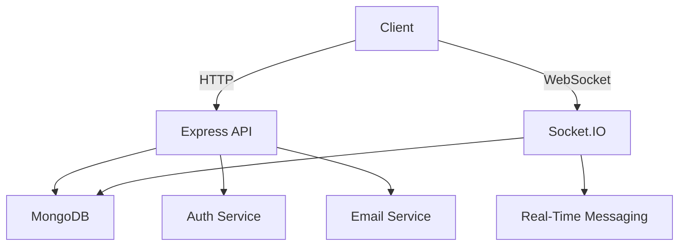

# SwiftChat - Real-Time Communication Platform 🚀


A modern full-stack chat application with real-time messaging capabilities, user authentication, and premium features management.

## 🌟 Features

### Core Functionality
- **Real-Time Messaging**  
  ✨ WebSocket-powered instant message delivery  
  💬 Support for text-based conversations  
  🕒 Message history persistence

### User Management
- 🔐 JWT Authentication & Authorization
- 📧 Email Verification System
- 👤 Profile Management:
  - Avatar selection
  - Personal info updates
  - Email management
- 👥 Contact List:
  - Online/Offline status indicators
  - User search functionality

### Premium Features
- 💰 Subscription Plans (Starter, Company, Enterprise)
- 🛡️ Enhanced Security Features
- 🚀 Premium Support Options

### UI/UX
- 🎨 Tailwind CSS Styling
- 📱 Fully Responsive Design
- 🎭 Dark Mode Interface
- 🧩 Component-Based Architecture

## 🛠 Technology Stack

### Frontend
| Technology       | Purpose                          |
|------------------|----------------------------------|
| React 18         | Core UI Framework                |
| Vite 4           | Build Tooling                    |
| Tailwind CSS 3   | Styling Framework                |
| React Router 6   | Client-Side Routing              |
| Socket.io-client | Real-Time Communication          |
| Axios            | HTTP Client                      |

### Backend
| Technology       | Purpose                          |
|------------------|----------------------------------|
| Node.js 18       | Runtime Environment              |
| Express 4        | API Framework                    |
| MongoDB          | Primary Database                 |
| Mongoose 7        | ODM for MongoDB                  |
| JSON Web Tokens  | Authentication/Authorization     |
| Bcrypt.js        | Password Hashing                 |
| Socket.io        | WebSocket Implementation         |

### Supporting Services
- Nodemailer (Email delivery)
- React Hot Toast (Notifications)
- Day.js (Date formatting)

## 🚀 Installation

### Prerequisites
- Node.js 18+
- MongoDB 6.0+
- SMTP credentials (Mailtrap/Mailgun)

### Setup Instructions

```bash
# Clone repository
git clone https://github.com/yourusername/swiftchat.git
cd swiftchat

# Backend setup
npm install
cp .env.example .env  # Update with your credentials

# Frontend setup
cd frontend
npm install
cp .env.example .env  # Set API endpoint

# Start development servers
cd ..
npm run dev & cd frontend && npm run dev
```

Environment Variables Template:
```ini
# Backend .env
PORT=5000
MONGODB_URI=mongodb://localhost:27017/swiftchat
JWT_SECRET=your_jwt_secret
SMTP_HOST=smtp.mailtrap.io
SMTP_PORT=2525
SMTP_USER=your_smtp_user
SMTP_PASS=your_smtp_password

# Frontend .env
VITE_API_BASE_URL=http://localhost:5000/api
```

## 🖼️ Application Screenshots

| Feature          | Preview                          |
|------------------|----------------------------------|
| Landing Page     |  |
| Chat Interface   |  |
| Profile Settings |  |
| Subscription     |  |

## 🌐 System Architecture



## 🤝 Contributing

1. Fork the repository
2. Create your feature branch (`git checkout -b feature/amazing-feature`)
3. Commit changes (`git commit -m 'Add amazing feature'`)
4. Push to branch (`git push origin feature/amazing-feature`)
5. Open a Pull Request

## 📜 License

Distributed under the MIT License. See `LICENSE` for more information.

---

**Happy Coding!** 👨💻👩💻  
*Building connections in real-time*
